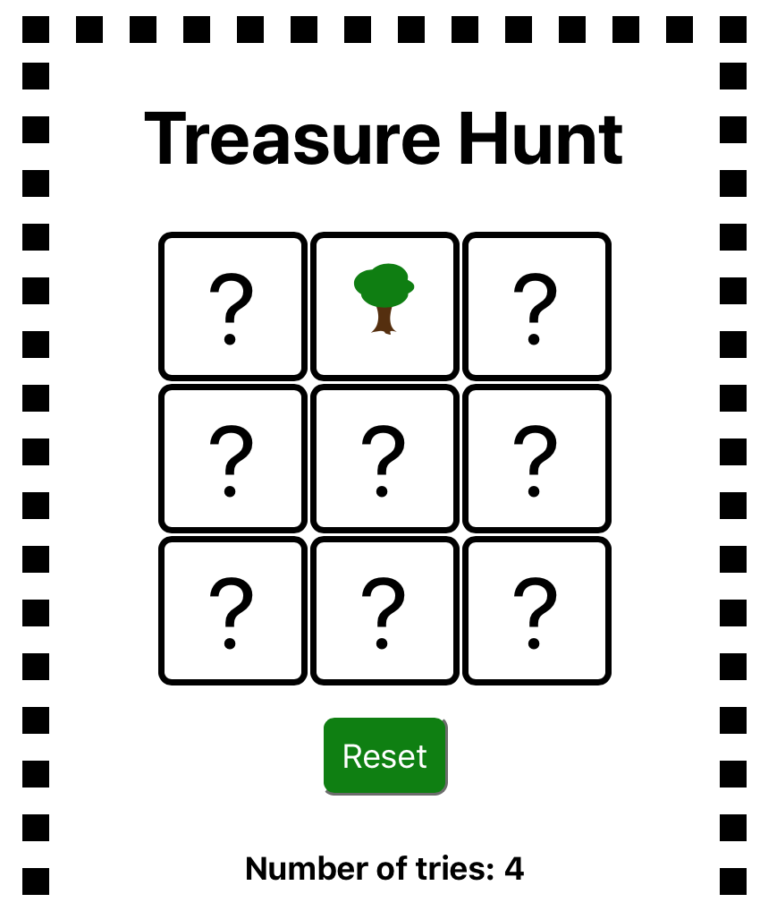
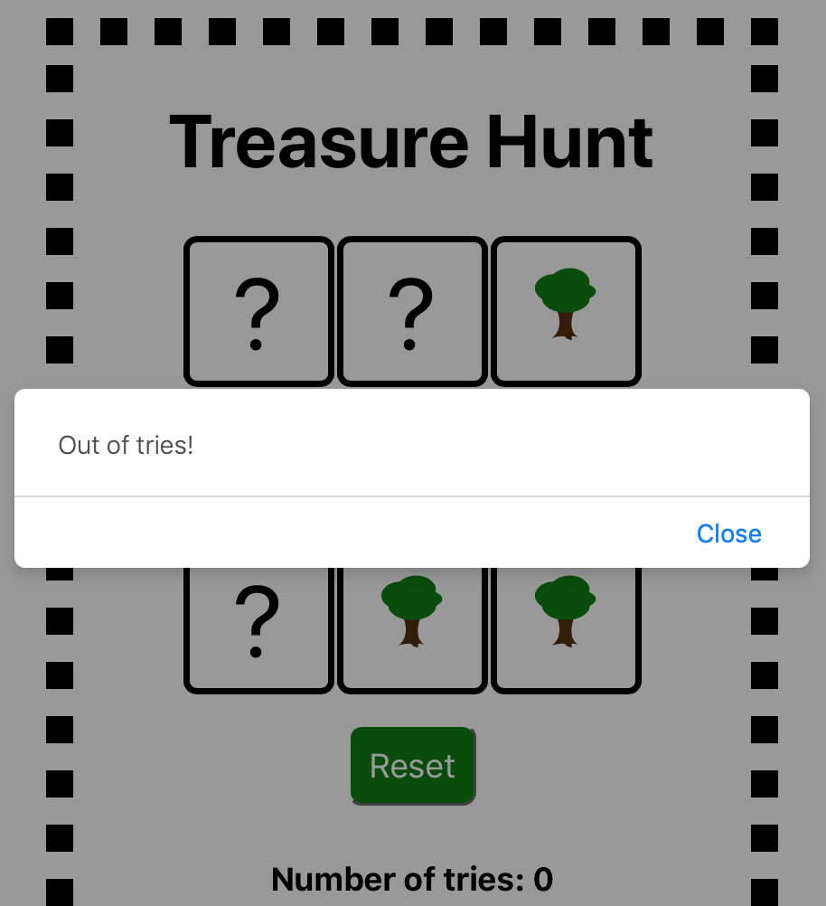
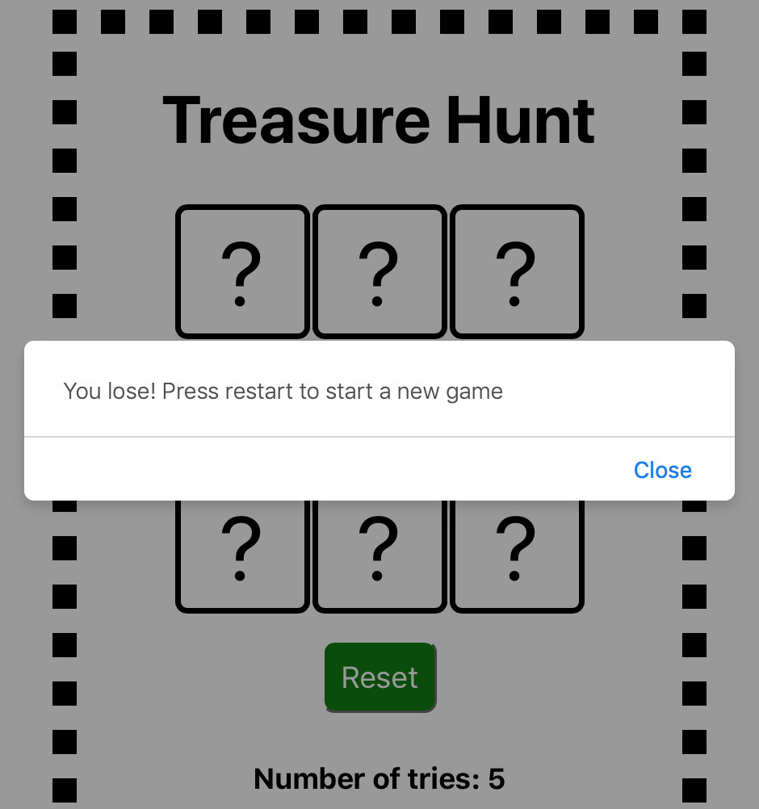
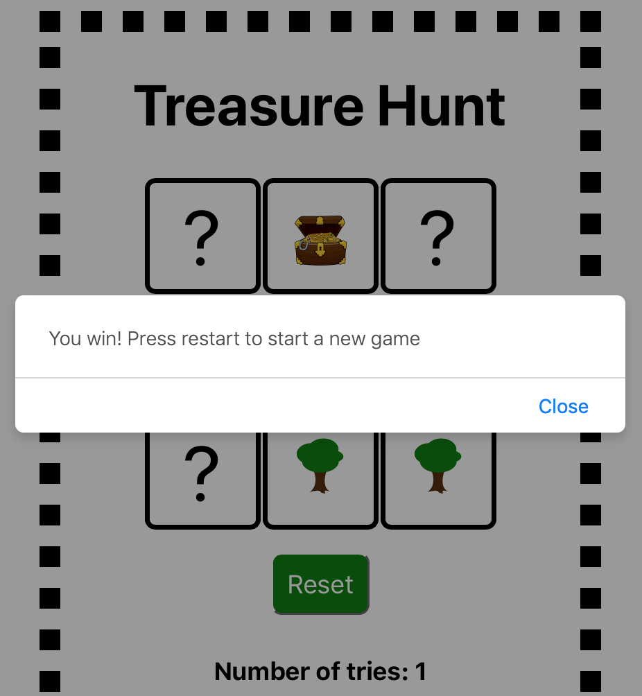

Treasure Hunt is an easy to use application that involves guessing the location of treasure on a 3x3 board. The application was built using React.js, HTML and CSS.

To use, a player can guess the location of the treasure by clicking on one of the question marks. The player has 5 guesses per game. There is a "Number of tries" display below the board that indicates the number of tries that the player has remaining. If the player makes a guess incorrectly, a tree will appear in place of the location of the guess and the "Number of tries" will decrease by 1.

If the player runs out of guesses, a popup message will appear indicating that the player has ran out of guess attempts. Upon closing the message, the board will automatically reset.

Each game, there is one bomb randomly placed in one of the locations on the board. If the player clicks on the location of the bomb, a popup message will appear indicating that the player has lost. Upon closing the message, the board will automatically reset.

To win, the player will need to guess the location of the treasure within 5 tries, and without clicking on the bomb. If the player is able to find the treasure, a popup message will appear indicating that the player has won. Upon closing the message, the board will automatically reset.

